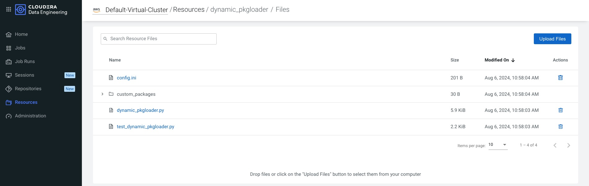
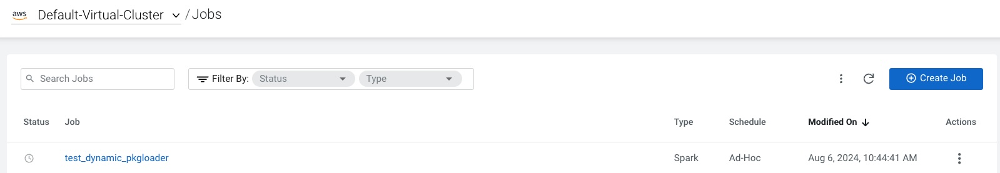
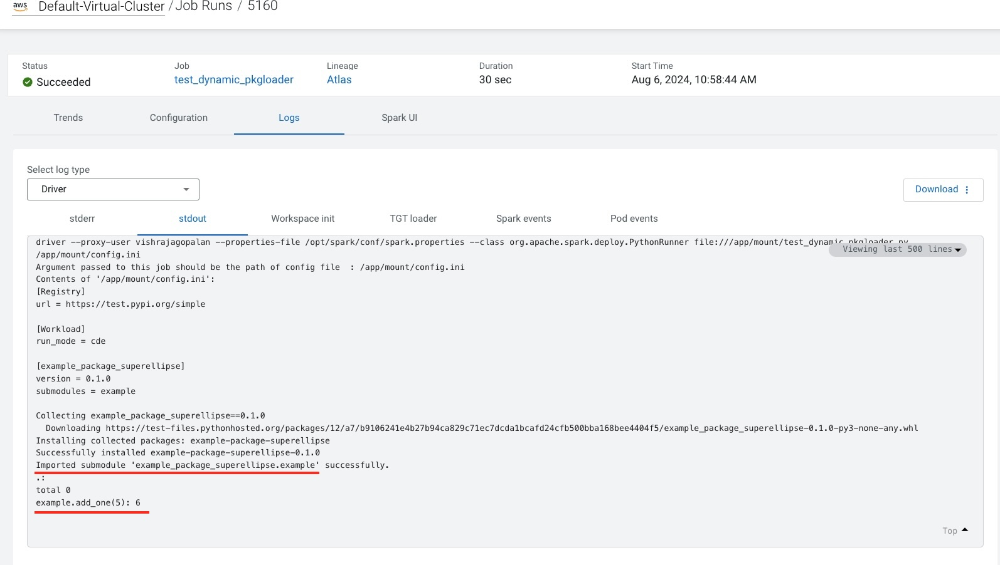
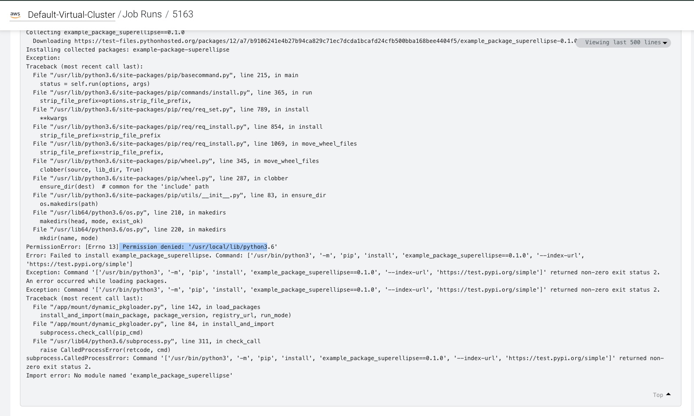

# A Dynamic Package Loader to access Custom Python Libraries in Cloudera Data Engineering dynamically on workload execution. 
## Purpose
This demo demonstrates an approach to Dynamic Package Loading in CDE. Dynamic Package Loading allows CDE workloads to use custom built python packages dynamically during a job run without requiring them to set up a python virtual environment with a requirements.txt. This should NOT be construed as a replacement of a python virtual environment. Infact, Dynamic Package loader can also be used inside a python virtual environment. Dynamic Package Loading is  helpful when data engineers are building and testing new packages and are needing to load the latest version of packages that are changing repeatedly. 

## Pre-requisites
- Access to a Cloudera Data Engineering Cluster
- CDE ClI tool configured to access this cluster. 
- Python version >3.6 <3.8 ( Only for the Demo package installation to be tested. For your own packages you can use a higher version of python as well)

**Important Note:** 
- In this example we are using the default CDE cluster, you may need to modify the CLI commands below with the --vcluster-endpoint flag if you are using a different cluster. 
- When testing this tool locally please change the run_mode flag to local in the config.ini file and DO NOT provide the argument for the config file in Step 6
- If you change the names of the CDE resource or the config.ini file then you will have to make appropriate changes in the dynamic_pkgloader.py file as well. It is recommended to keep this the say it is for now. 

## Code Artefact Explanations 
As mentioned in the purpose, the intent is to use custom packages dynamically with a CDE workload job. Review the config.ini file, the sections are self explanatory. This example contains the following contents
```
your-working-folder
-| cde-dynamic-pkg-loader
    -| config.ini     # configuration file
    -| dynamic_pkgloader.py  # the pkgloader module to be imported in any example where you want to load the packages
    -| test_dynamic_pkgloader.py # Demonstrates example usage of dynamic package loader. 
    -| custom_packages # This folder will load the custom_packages dynamically loaded by cde job. 
        -|.empty_file.txt # simply an empty file to ensure custom_packages does not get deleted. 

```
### Configuring config.ini
The structure of the ini file is provided below. 
```
[Registry]
url = https://test.pypi.org/simple
[Workload]

# when deploying to cde change this from "local" to "cde"
run_mode = cde

# submodules of package can be CSV separated such as example, example1 etc. 
[example_package_superellipse]
version = 0.1.0
submodules = example
```

**Important Notes** 
- The url is the location of the package registry or pypi mirror. This assumes that any authentication information is already included in the https:// URL string. Before you enter this, make sure to the following on the local folder to check access to the remote pypi registry is working ok
```
pip install -i <the url value you want to enter > <package-name>
```

- run_mode = cde , when running this demo on the cde cluster or local when running on a local system ( non-cde ie. Laptop or another cluster node). This is required because CDE looks for files in /app/mount folder
- your packages should always follow the format of the example package as a section and and submodules as a key. 

## Demo Steps : 

- Step1 : Clone this repo in a compute system ( laptop, node) , which is configured to use CDE CLIO. We will  run CLI commands on a remote CDE Cluster from this folder
- Step  2 : Create a remote CDE resource with the following code 

```
# add --vcluster-flag==<jobs api url> if you are not using the default cluster as shown below

cde resource create --name dynamic_pkgloader
```

- Step 3: make sure you are iside the folder where you have cloned the repo before creating a gzip file below 
```
COPYFILE_DISABLE=1 tar -cvf - --exclude='.DS_Store'   *.py config.ini custom_packages | gzip -v >dynamic_loader.tar.gz 
```

- Step 4: Upload this gzip file to the CDE resource
```
cde resource upload-archive --name dynamic_pkgloader --local-path ./dynamic_loader.tar.gz
```

Verify that you are able to see the python and ini files in the CDE cluster as shown below.


- Step 5: Create a new CDE Job to load a custom package from the pypi registry with the Dynamic Package Loader
```
cde job create --name test_dynamic_pkgloader --type spark --mount-1-resource dynamic_pkgloader --application-file test_dynamic_pkgloader.py

```

Verify that you are able to see the job created in your Virtual Cluster as shown below. 



- Step 6: Run the CDE Job from the command line. 
```
cde job run --name test_dynamic_pkgloader  --verbose --arg /app/mount/config.ini
```
This should load the package dynamically and execute the following code , which is a function in the example subpackage we have loaded earlier. 


```
    example.add_one(5):
```

The output of this code execution can be verified as below in CDE below


## Additional Readings/ References: 
- [Building and using Custom Packages in CDE](https://github.com/SuperEllipse/CDE_Custom_Pypimirror?tab=readme-ov-file)

## Trouble shooting:
If you are getting a PermissionError as below, when running the job in CDE , check if you have changed the run_mode to cde in the config.ini file. delete the dynamic_loader.gz file locally and run steps 3,4 and 6 again
